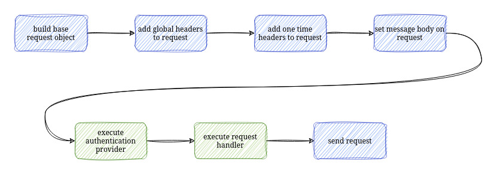

The building of the request takes several steps. Some steps are done internally by ILEvator but
at some point you can hook into the build process and modify the request as you need it, f. e. 
adding a custom HTTP header.



If global HTTP headers are set on the HTTP client instance they will be added first. The HTTP
headers which have been passed for this request will be append behind the global headers. The
HTTP protocol states that the last one wins (in most cases, there are some exceptions). So a 
HTTP header for this request will overwrite the global header.

## Authentication Provider

With `iv_setAuthProvider` a request handler can be registered at the client. The authentication
provider needs to be provided as a pointer to a data structure. The data structure needs to 
have a procedure pointer as its first subfield.

```
dcl-ds iv_auth_t qualified template;
    processRequest pointer(*proc);
end-ds;

```

As the authentication provider is passed as a pointer to the ILEvatotr procedure the data
structure can have as many subfields as you need. It is just important that the first 
subfield is the procedure pointer to the procedure which will be called by ILEvator. Take
a look at the Basic Auth provider which comes with the ILEvator project.

The procedure which will be called by ILEvator needs to implement a specific procedure interface.

```
dcl-pi *n;
    authProvider pointer value;
    request pointer value;
end-pi;
```

The first parameter `authProvider` is a pointer to your data structure. So you have access to all
the data you put into your data structure in the first place.

```
dcl-ds myAuthProvider likeds(my_auth_provider_t) based(authProvider);
```


## Request Handler

After executing the authentication handler procedure the request handler is called by ILEvator if 
one has been registered. The request handler can be registered with calling `iv_setRequestHandler`.

The request handler has the same concept and interface as the authentication provider.

After the request handler has been called the request object will be serialized and sent to the server.
